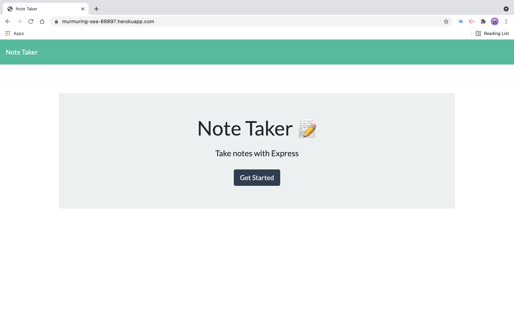
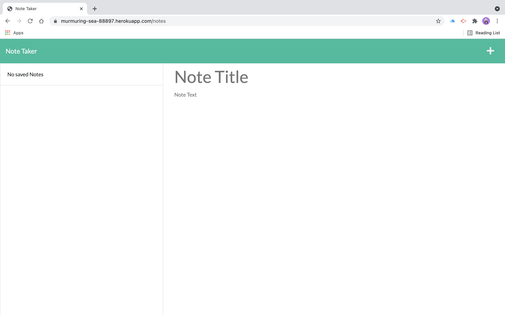
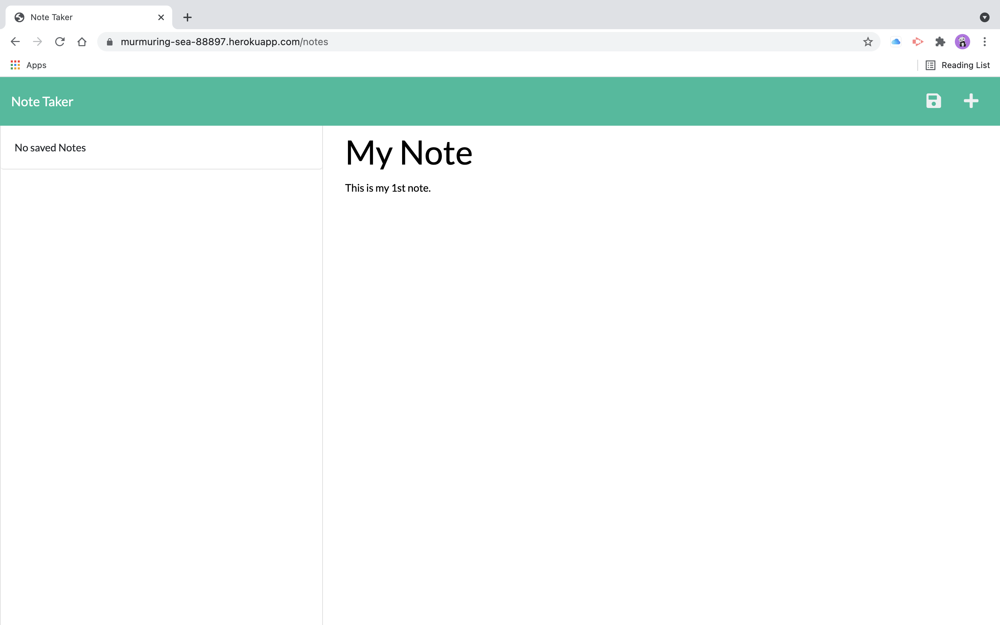
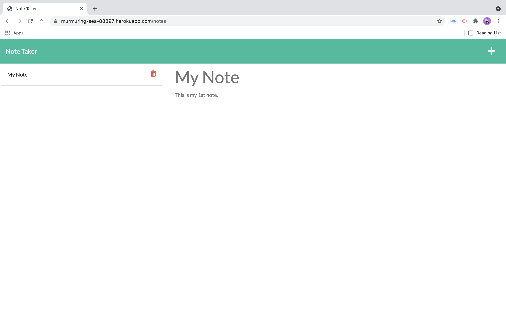

# Note Taker

## Description

This is a basic note taking application.  It uses Express.js and JSON for data storage and retrieval.

## Usage

1. Go to https://murmuring-sea-88897.herokuapp.com to get to the Note Taker landing page.  

2. Click the Get Started button to go to the notes page.

3. Start typing your notes.  Click the save button when done.

4. Your note will be added to the list on the left column.

5. To delete a note, click on the trash icon next to the note you want to delete.